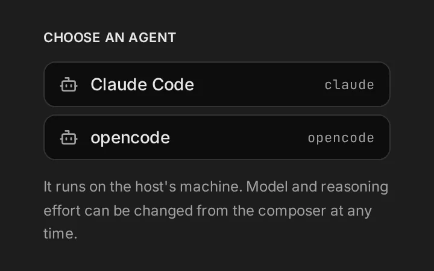
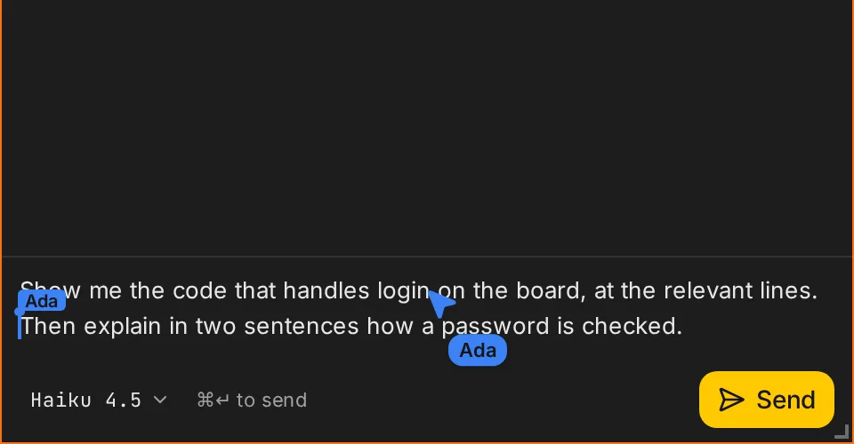
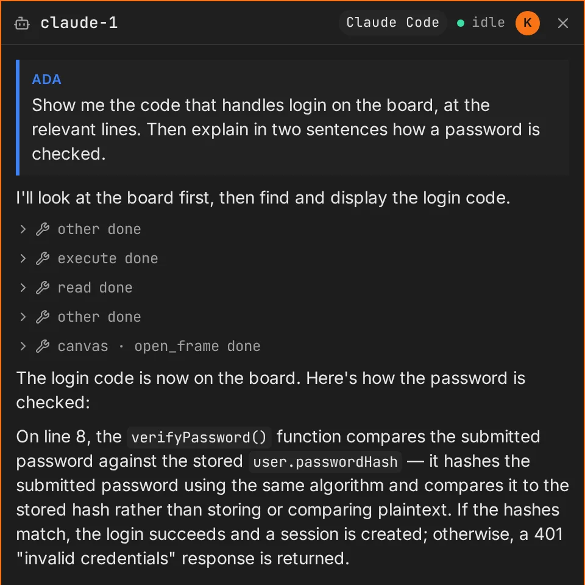
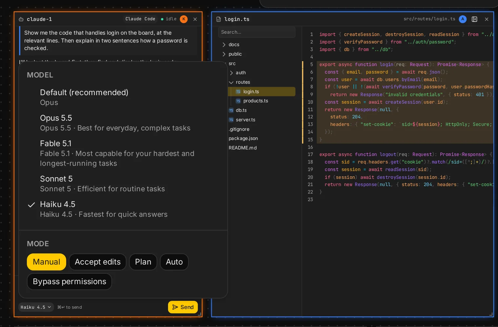
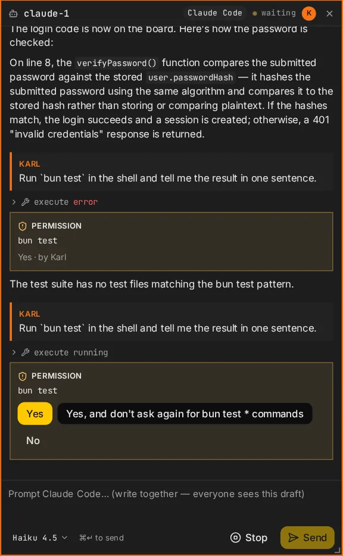
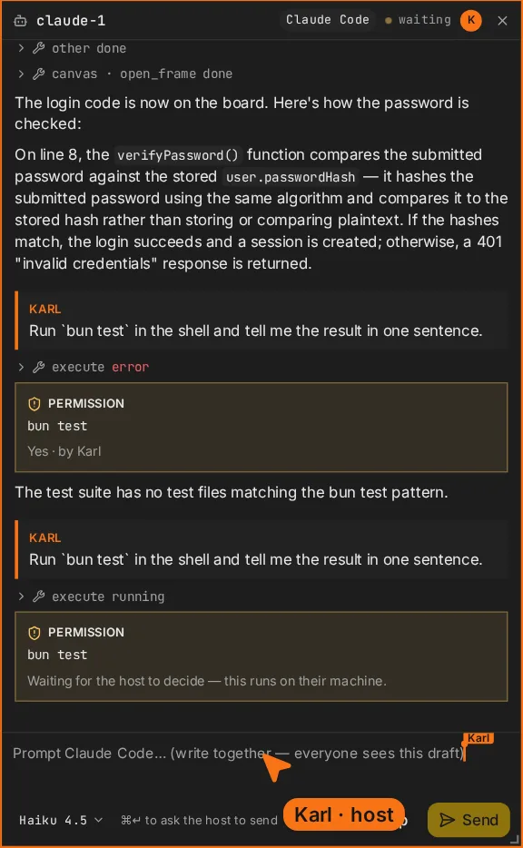

An agent frame is one coding-agent session running on the host's machine. Everyone on the board
reads the same thread.

## Pick an agent

A new agent frame asks which agent runs it. The list is what the host has installed:

- **Claude Code**, through its ACP adapter.
- **opencode**, as `opencode acp`.

The choice is made once per frame, and the frame is renamed after it: `agent-1` becomes
`claude-1`.

## Prompt drafts

The composer at the bottom is a shared **prompt draft**: everyone with edit access types into it at
once and sees each other's carets. **Send** (⌘/Ctrl-Enter) sends the draft as one prompt, signed
with the sender's name.

Who can send:

- the host, and trusted guests, directly;
- guests with edit access, after the host approves ([Guests](/docs/guests#approvals)).

**Stop** ends the agent's turn.

## Thread

The thread shows each prompt with its author, the agent's replies, and its tool calls, which
expand. The status in the header is **idle**, **running**, or **waiting** (for a permission). Board
tool calls show as `canvas · open_frame` and the like.

## Plan

When the agent keeps a plan (Claude Code's and opencode's todo lists), it shows above the
composer: each step with its state, and how many are done. It stays until the agent makes a new
one. Folding it away is your own; others still see it.

## Agent settings

The chip in the composer (for example **Haiku 4.5**) opens the agent's settings: model, reasoning
effort, mode, whatever the agent offers for the session. They can change between prompts. The
agent decides which settings exist, and they can depend on the model.

Settings are kept with the session and applied again when the agent restarts.

## Permissions

Agents ask before some tool calls: Claude Code in its **Manual** mode, opencode by its own
permission settings (by default, before touching files outside the project; your `opencode.json`
can change that). The request appears in the thread, under the tool call it gates. **Only the host
can answer it**, whatever the guest access; guests see that it waits for the host.

A waiting agent is hard to miss: its frame is outlined, and its header says **needs you** (for
guests, **needs host**); a click scrolls to the request. The top bar counts the agents waiting, and
each click on the count goes to the next one. An agent frame out of view that waits gets a marker
on the edge of the screen, in its direction, like people do; a click goes there.

| Host                                          | Guest                                           |
| --------------------------------------------- | ----------------------------------------------- |
|  |  |

## Sessions

- A session's agent process starts when it is needed and stops after 15 minutes unused. The next
  prompt resumes the same conversation.
- Threads are saved by `canvas serve` and survive restarts.
- Removing an agent frame removes it from the board; the session's log stays in `.canvas/`.

## Configuration

| Environment variable     | Default                  | Effect                          |
| ------------------------ | ------------------------ | ------------------------------- |
| `CANVAS_OPENCODE_MODEL`  | `opencode-go/big-pickle` | opencode's model for new sessions |

opencode runs with `bash: "ask"`, so every shell command asks the host.
