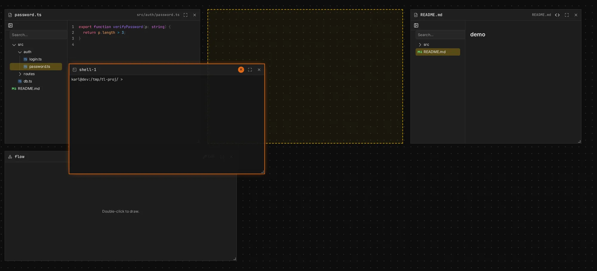

The board is one shared surface. Every frame's place, size and title is shared: when someone
moves a frame, everyone sees it move.

## Layout

The board is not a free canvas. Frames don't sit wherever they are dropped: they **snap into
place**, side by side, never overlapping and never lost somewhere off to the side. The idea comes
from scrolling tiling window managers like [niri](https://github.com/YaLTeR/niri): you say where a
frame goes next to the others, and the board works out the rest.

- **A row** is frames side by side, sharing a height and their borders.
- **A cluster** is rows of frames stacked top to bottom: one piece of work, like an agent with the
  files and terminal it uses. It can have a name. A frame on its own is a cluster of one.
- **Lines** hold the clusters, left to right, with space between them; lines go top to bottom.

Drag a frame by its header and it snaps: **beside a frame**, into its row; **above or below a
row**, into a new row of that cluster; **between clusters**, into a cluster of its own. The others
make room, and a dashed outline shows where it will land before you let go; others see a ghost of
it in your colour. Hold **Alt** to drop it into a new cluster wherever the pointer is; **Esc** calls
the drag off.

- **Clusters move** by the grip left of their name, or by any of their frames with **Shift** held.
  Click the name field above a cluster to name it.
- **Edges resize**: a vertical edge sets the width of the frame left of it, a horizontal one the
  height of the row above it. The rest moves along.
- **Gaps close** by themselves when a frame is moved or removed.
- **Your frame stays put** when someone else changes the layout: the rest of the board moves
  around it.

Because the board has this shape, the fastest way around it is the [keyboard](#keyboard): go to
the frame left, right, above or below, move the current one the same way, jump between clusters,
open a new frame beside the one you are in. [Full screen](#full-screen) shows one row at a time.

Agents arrange frames the same way: they name frames and sides, never coordinates
([Board tools](/docs/board-tools)).

## Navigate

| Do                                   | To                    |
| ------------------------------------ | --------------------- |
| Drag the empty board                 | Pan                   |
| Drag with the middle button, anywhere | Pan                  |
| Hold Space and drag, anywhere        | Pan                   |
| Wheel, or swipe on a trackpad, outside a frame's content | Pan |
| ⌘/Ctrl + wheel, or pinch             | Zoom about the pointer |
| **−** / **+** in the corner          | Zoom out / in         |
| Press the zoom percentage            | Back to 100%          |
| **Fit** (the arrows in the corner)   | Fit every frame into view |

The middle button and Space pan over frames too, without touching them. Space is a space while you
type into something: a prompt, a terminal, a title. Press the board first. A drawing being edited
keeps both for its own canvas, and a press inside a browser frame's page never reaches the board:
hold Space there, or drag its header.

The viewport is yours alone; it is kept per board in your browser.

## Keyboard

The keyboard moves over the board's frames, for your left hand while the right one stays on the
mouse. The **current frame** is the one you are in (full screen's, or the one you occupy:
[Focus](/docs/focus)).

| Keys                          | To                                                               |
| ----------------------------- | ---------------------------------------------------------------- |
| **W A S D**, or **H J K L**   | The frame above, left, below or right; the view goes along if it is off screen |
| Shift + **W A S D**           | Move the current frame that way: along its row, or into the row above or below |
| **Q** / **E**                 | The cluster before / after                                        |
| **F**                         | Full screen on the current frame, or back                         |
| Shift + **F**                 | The whole board; again, back, to the frame you are on by then     |
| **1** – **5**                 | A new Agent, Files, Browser, Terminal or Drawing frame beside the current one |
| Shift + **X**                 | Close the current frame, on to the one beside it                   |
| **Esc**                       | Out of a field (a prompt, a title) to the board: the keys work again |
| Hold **Space**                | Pan                                                               |

- **Going to a frame occupies it**, as pressing on it does. With no current frame, the first key
  goes to the frame in the middle of the view.
- **Left and right** go along the row, then on to the nearest frame that way, in the next
  cluster too. **Up and down** go to the frame under the current one's middle in the row beside.
- **Keys are the field's while you type**: a prompt, a title, a terminal, a drawing being edited.
  A terminal keeps Esc too, for the programs in it.
- **In the whole board**, the keys go from frame to frame without leaving it; the one you are on
  is where Shift + **F** takes you back to, at the zoom you had.
- Letters go by their place on the keyboard, whatever its layout.

## Full screen

Full screen shows one row of frames at 100%, as tall as your screen, to work in them one at a
time.

| Do                                           | To                               |
| -------------------------------------------- | -------------------------------- |
| **F**, or the ⤢ in a frame's header          | Full screen on the current frame, or that one |
| **A** / **D**, **H** / **L**, or Alt + **←** / **→** | The frame before / after it |
| **W** / **S**, **K** / **J**                 | Full screen on the row above / below |
| **‹** / **›**, or a dot, in the top bar      | The frame before / after, or that one |
| Wheel, drag or swipe                         | Along the row                    |
| **+** on a frame's edge                      | Add a frame there                |
| Drag a frame's header                        | Move it along the row            |
| **F**, the **×** in the top bar, or zoom     | Leave full screen                |

- **It is yours alone.** The frames of the row take your screen's height on your board only;
  everyone else sees them as they are. Terminals keep a height of their own, half the host's
  screen until someone drags their bottom edge: the host's terminal sizes it for everyone, so
  everyone's full screen shows that height, taller or shorter than their screen.
- **Going to a frame occupies it**, as pressing on it does ([Focus](/docs/focus)).
- **The rest of the board is hidden**, and so are the toolbar and zoom controls: the **+** on a
  frame's edge adds one ([Frames](#frames)), and full screen goes to it.
- **Frames only move along the row**: over the left or right half of another, a dragged frame
  goes before or after it, and the others make room. Hold a frame near the left or right side of
  the screen to scroll the row that way. The edges between frames set their widths.
- **Leaving with F or ×** takes you back to where you were before full screen. Esc doesn't
  leave: it takes you out of a field, so the keys work again ([Keyboard](#keyboard)).
- **Someone else changing the row** doesn't move you: the frame you are on stays where it is on
  your screen, and the others move around it, whether they resize, reorder, add or take frames
  away. Full screen stays on the row even if your frame is moved out of it: you go on to the one
  before or after it.
- **Closing a frame** goes on to the next one in the row; closing the last leaves full screen.
- **Others see where you are**: a chip with your name on the header of the frame you are on, and a
  ring in your colour around its dot in their full-screen bar. You see theirs the same way.
- **Following someone in full screen** takes you into full screen on their frame, at your own
  screen's size, and along the row as they go. When they leave full screen, you do too, and go on
  following their view. Your own pan, zoom or step ends following and leaves you where you are.
- **Following someone who isn't in full screen** ends yours, as does anything that zooms or leaves
  the row.

## Links

Links in agent replies, comments and markdown and HTML files go to places on the board: a frame,
a file, lines of it, a markdown heading or a comment. They show as chips. Inline code that names a
file of the project, like `src/auth/session.ts:42`, is a chip too.

- **Following a link is yours.** The view moves to the frame, and you occupy it, or go your own
  way in it if someone else does ([Focus](/docs/focus)). Lines are scrolled to and become your
  selection; a heading is scrolled to.
- **What frames show is shared.** A file no frame shows opens in a new frame beside the link. A
  frame the link names switches to the file, and to source for lines, or preview for a heading,
  as picking it in the tree would. `view` guests go to frames but open none.
- **Back and Forward** go between the places links took you. The page URL then names the place, so
  a guest link with `&frame=<id>` added opens the board at that frame.
- **Web links** open in a new tab.

Links are ordinary markdown links. A path is from the project root, or, in a file, from that file:

| Link                                  | Goes to                                  |
| ------------------------------------- | ---------------------------------------- |
| `[x](src/a.ts)`                       | The file                                 |
| `[x](src/a.ts#L10-L20)`, `src/a.ts:10-20` | Lines of it                          |
| `[x](docs/guide.md#install)`, `[x](#install)` | A heading, in another file or this one |
| `[x](canvas:scratch/notes.md)`        | A scratch file                           |
| `[x](#frame=<id>)`                    | A frame; add `&lines=10-20`, `&path=…` or `&comment=<id>` |

A file on another [runtime](/docs/glossary) than the board's, or in another root of it, adds
`&runtime=<id>` (and `&root=<id>`) to the link; a path in a file is of that file's. Links on a
board with one runtime never need them.

Agents are told how to link, and [`view_board`](/docs/board-tools) gives them frame ids.

## Frames

- **Add** a frame from the toolbar: **Agent**, **Files**, **Browser**, **Terminal**, **Drawing**.
  It goes beside the frame you are in, or, if you are in none, in a cluster of its own, and the
  board takes you there.
- **Add** one exactly where you want it with the **+** on the left or right edge of a frame: it
  shows when your mouse is near the edge, one for the edge two frames share, and is the same size
  at any zoom. Pick a kind: the new frame goes there, the rest of the row makes room, and the board
  takes you to it.
- **Move** it by its header, **resize** it by its edges.
- **Rename** it by clicking its title in the header.
- **Remove** it with the **×** in its header.
- An agent, files or terminal frame is on the board's [runtime](/docs/glossary), the host's
  `canvas serve`. One that names another runtime shows **Not reachable**, for everyone, and
  nothing of it is opened; it still moves and closes.

## Presence

- Everyone's **pointer** shows with their name; the host's is marked **host**.
- Someone **out of view** shows as a marker on the edge of the board, in their colour, pointing
  their way: to their pointer, or, while it is off their board, to the middle of what they see.
  Click it to go there.
- **Click someone's avatar** in the top bar to **follow their view**: your board shows what theirs
  shows, framed in their colour, as they pan and zoom. On a screen of another size you see all of
  theirs, and more around it. If they are in [full screen](#full-screen), you are too, on their
  frame. Panning or zooming yourself lets go, as do **Stop**, their avatar again, or their leaving. Following a view is not following a frame's occupant
  ([Focus](/docs/focus)), though the two go together: follow someone's view into the frame they
  occupy and you scroll with them there too.
- **Text selections** in agent threads and files frames show in the selecting person's colour.
- The top bar lists everyone on the board. Your **name** is the field next to it; a new browser
  gets an animal name and a colour.
- Each browser has a **fingerprint**, like `ab12 cd34`: yours is next to your name, everyone
  else's on their pointer and in their avatar's tooltip. The host checks each one as people join,
  so a name can be anything, but a fingerprint can't be borrowed: if someone's shows **not
  verified**, the host hasn't vouched for it. It stays the same as long as you use the same
  browser; another browser or device has another one. It also says which comments are yours.

Presence carries no authority, and goes directly between peers, but only between those the host
let in: someone waiting in the [lobby](/docs/guests#the-lobby) sees nobody's, and nobody sees
theirs.
