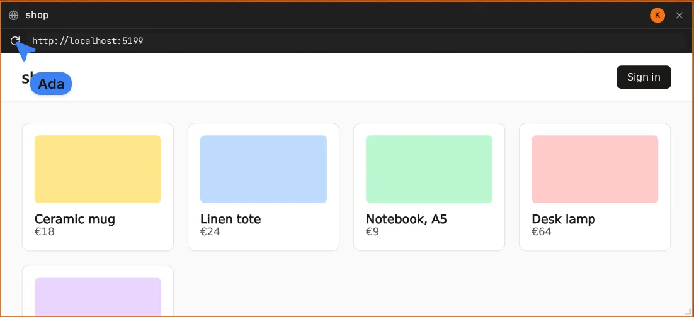

A browser frame shows a web page. The URL is shared; the page is not: each viewer's own browser
loads it.

- **Change the URL** in the frame's address bar. Everyone's frame follows.
- **Reload** with the arrow next to it. Reloading is yours alone.
- A URL without a scheme gets `https://`.

## localhost

`localhost` means each viewer's own machine. A dev server running on the host's machine shows in
the host's frame, not in guests' frames. Guests need a URL their browser can reach.

## Limits

- Pages that forbid being framed (`X-Frame-Options`, `frame-ancestors`) stay blank.
- Scrolling inside the page is not shared.
