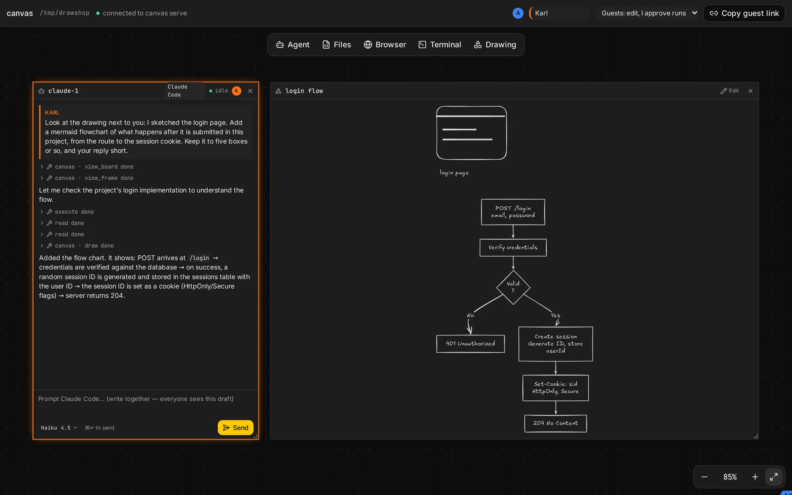
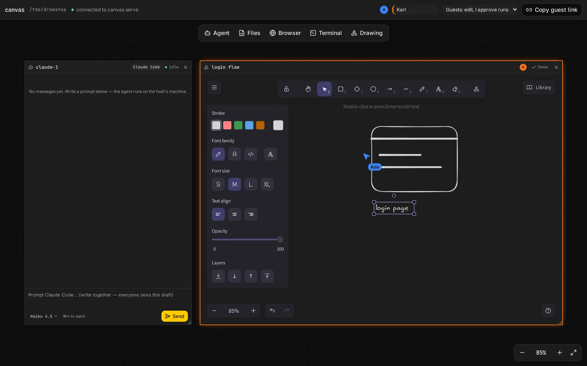

A drawing frame is a whiteboard: [Excalidraw](https://excalidraw.com), inside the board. Everyone
draws on the same drawing and sees everyone else's strokes as they happen. Agents look at it and
draw on it too.

## Draw

- **Add** one from the toolbar: **Drawing**.
- **Double-click** it, or press **Edit** in its header, to draw. Excalidraw opens where the drawing
  was, with its tools: shapes, arrows, lines, the pen, text, the eraser.
- **Done**, or a click anywhere outside the frame, puts it back. At rest it is a picture that
  zooms with the board like any other frame.
- **⌘/Ctrl + wheel** zooms the drawing while you draw, not the board. The wheel pans it.
- **Undo** takes back only your own changes, not other people's.

Drawing is yours: others see your changes live, but not your tools, selection or view. Several
people can draw in the same drawing at once.

## Agents

Agents see a drawing when they [look at the frame](/docs/board-tools#drawings): as an image, and as
a list of its shapes, labels and arrows. So you can sketch something and ask "what's missing
here?", or ask an agent to draw an architecture next to your notes. Agents draw with shapes and
arrows, or with a [mermaid](https://mermaid.js.org) flowchart, sequence or class diagram, which
turns into shapes you can then move and change.

Whether an agent can read the image depends on its model: models without image input work from
the list of shapes only, and don't see freehand strokes.

## Guests

Guests with the edit role draw like the host. **View** guests see the drawing but get no **Edit**.

## Limits

- **No images** in drawings yet: the image tool is off, and pasted images are refused.
- **Embeds** (web pages inside a drawing) don't load, as they would load any URL on everyone's
  machine.
- **Links** on shapes go to places on the board like [other links](/docs/board#links); web links open in
  a new tab.
- Excalidraw's full toolbars need about 500 pixels of height on screen. In a smaller or zoomed-out
  frame it shows its compact toolbars instead.
- Removed shapes stay in the board's data, marked removed, as Excalidraw keeps them.
