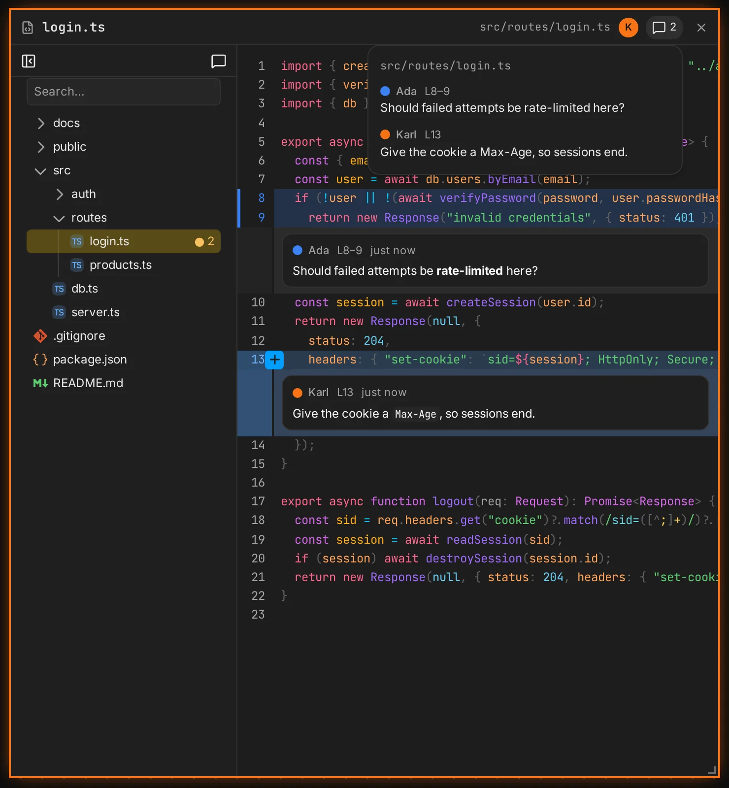

A files frame shows one file of the project, read-only and live: when the file changes on disk,
for example because an agent edited it, everyone sees the new content.

## Pick a file

- A new files frame opens with its **file tree**. Pick a file, or search the tree.
- **⌘/Ctrl-click** a file in the tree to open it in a new frame.
- The toolbar above the search hides the tree; **Show files** in the header brings it back. The
  tree is yours alone; the file shown is shared.

The tree lists the [shared set](/docs/security#the-shared-set): the files `canvas serve` lets out.
Anything outside it cannot be opened. It also lists the [scratch files](/docs/board-tools#scratch-files)
agents wrote for the board, under `canvas:scratch`.

## Lists

An agent can give a files frame a **list**: the files of one topic, for you to click through at
your own pace instead of one frame per file. The agent decides what the tree shows: its own
folders and names, the order, and a line range per file, shown as a badge. A list can mix project
files with [scratch files](/docs/board-tools#scratch-files), such as a write-up at the top and a
visualisation at the bottom.

- Picking a file in the list shows it for everyone, at its lines.
- The **all files** button in the tree's toolbar switches your tree between the list and all files. In all files, the
  file shown is selected where it really lives. The switch is yours alone.
- The status bar always shows the file's real path.

## Views

- **Source**: syntax-highlighted, for any text file. Long files are virtualized.
- **Preview**: markdown and HTML files open rendered. The **<>** button switches between preview
  and source for everyone.

An HTML preview runs the page's scripts, sandboxed: the page can't reach the board or your
browser's storage for canvas. Its [links](/docs/board#links) work: a link to another HTML file
opens in the same frame, so a few pages make a small site. Assets relative to it (CSS, images,
other scripts) don't load, so inline them. The page keeps its own scroll, and selections don't
show in it.

Files over 1 MiB are **too large to show**; binary files are **not shown**. A path that does not
exist yet waits, and shows the file as soon as something writes it.

## Line ranges

A files frame can show a line range: it opens scrolled to it, with the lines highlighted for
everyone. Agents use this to point at code ([Board tools](/docs/board-tools)).

## Selections

Select lines in the source view (drag over the line numbers), or text in the preview, and everyone
sees the selection in your colour, labelled with your name.

## Comments

Comment on lines of the source to leave a note for everyone, people and agents alike. Hover a
line and click the **+** by its number, or select lines first (drag over the line numbers) and
comment on all of them. Comments are markdown. Each shows below its last line, with its author.

- **They belong to the frame**, not to the file. They stay while the frame shows other files, and
  are removed with the frame. A file opened in a new frame (⌘/Ctrl-click) starts without them.
- The **comments button** in the header counts them. It lists them all, by file. Picking one opens
  its file at its lines, in source, for everyone.
- In the tree, files with comments show their count. The comments button in the tree's toolbar
  shows only those files. That filter is yours alone.
- **Files change under comments.** When an agent edits the file, a comment moves with its lines.
  If its lines are gone, it is **outdated**: it shows above the first line, with what its lines
  used to read, until someone deletes it or the lines come back.
- Comments show in the source only. A markdown or HTML file switches to source when you pick one
  of its comments.
- You edit and delete your own comments, and the host edits and deletes anyone's. Agents read
  them with [`view_frame`](/docs/board-tools#comments) and can write their own.

## Guest access

- **edit** and **trusted** guests open files, browse the tree and comment, without approval.
- **view** guests see the files others open, but get no tree and cannot open files. They see a
  frame's list, but can't pick from it. They read comments, but can't write them.
