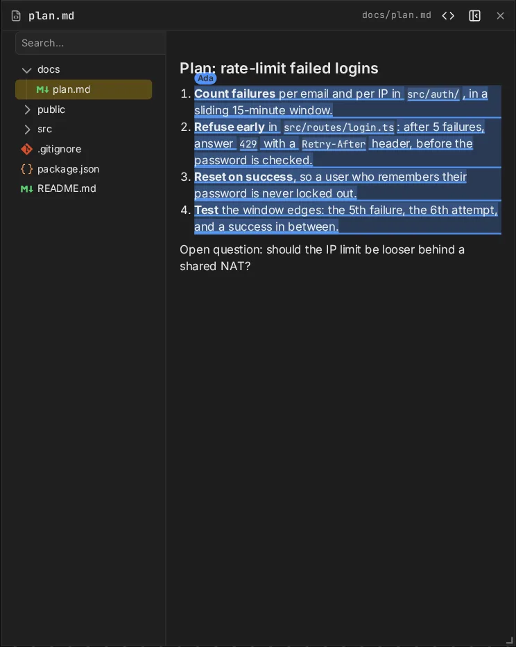
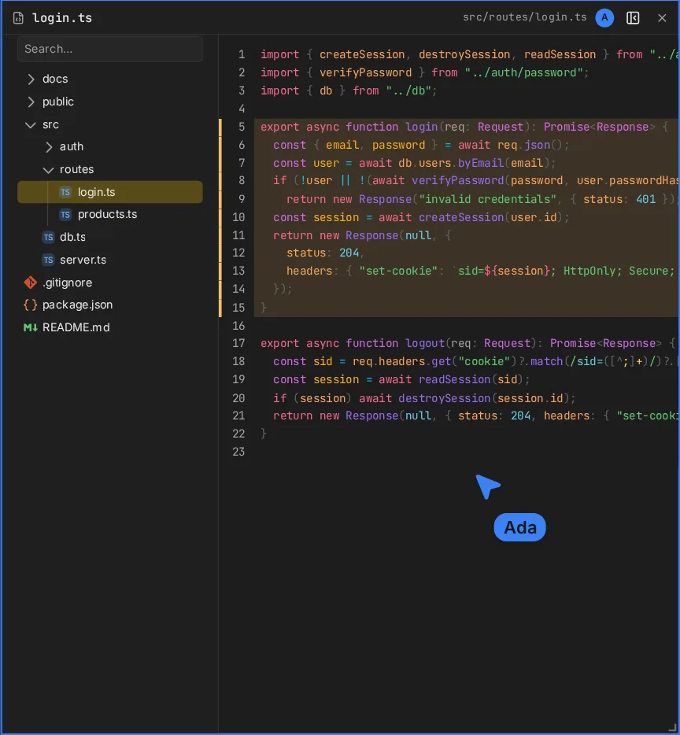

A files frame shows one file of the project, read-only and live: when the file changes on disk,
for example because an agent edited it, everyone sees the new content.

## Pick a file

- A new files frame opens with its **file tree**. Pick a file, or search the tree.
- **⌘/Ctrl-click** a file in the tree to open it in a new frame.
- The tree button in the header shows or hides the tree. The tree is yours alone; the file
  shown is shared.

The tree lists the [shared set](/docs/security#the-shared-set): the files `canvas serve` lets out.
Anything outside it cannot be opened.

## Views

- **Source**: syntax-highlighted, for any text file. Long files are virtualized.
- **Preview**: markdown and HTML files open rendered. The **<>** button switches between preview
  and source for everyone.

An HTML preview runs the page's scripts, sandboxed: the page can't reach the board or your
browser's storage for canvas. It is one file: links and assets relative to it (CSS, images, other
scripts) don't load, so inline them. The page keeps its own scroll, and selections don't show in
it.

Files over 1 MiB are **too large to show**; binary files are **not shown**. A path that does not
exist yet waits, and shows the file as soon as something writes it.

## Line ranges

A files frame can show a line range: it opens scrolled to it, with the lines highlighted for
everyone. Agents use this to point at code ([Board tools](/docs/board-tools)).

## Selections

Select lines in the source view (drag over the line numbers), or text in the preview, and everyone
sees the selection in your colour, labelled with your name.

## Guest access

- **edit** and **trusted** guests open files and browse the tree, without approval.
- **view** guests see the files others open, but get no tree and cannot open files.
