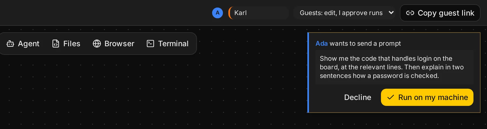

## Guest link

The host copies it from **Share** in the top bar: **Copy guest link**. Guests find the same link
there, to pass on; whoever they send it to knocks too. It holds the room's key and the host's
public key, but not where `canvas serve` is or a pairing code: only a browser paired as host
controls it. A guest link is an invite: it finds the board, and the host decides who comes in
and what they can do there.

Both links keep their secrets in the URL fragment (after `#`), which browsers never send to the
server hosting the web app.

## The lobby

Someone who opens the guest link in a browser the host hasn't let in yet waits in the **lobby**:
**Waiting for the host to let you in**, with their browser's whole
[fingerprint](/docs/board#presence). They see nothing of the board until then, nor anyone's
pointer, and nothing they do reaches it; nobody sees theirs. If something keeps them from the host
(the relay refuses the link, say), the lobby says what, with **Connection details**.

The host sees a card for each knock, and the [inbox](#the-inbox) counts it: the name they typed
and their whole fingerprint. Names are what people typed; if it matters, ask them to read you the
fingerprint their lobby shows. Then:

- **Admit to edit** or **Admit to view**: they are a **member** with that role, and the board
  appears for them.
- **Deny**: they are told the host didn't let them in. Opening the link again knocks again.

Members come back without knocking: the same browser, after a reload or another day, goes straight
in. Another browser or device is another fingerprint, and knocks. While the host's tab is closed,
nobody new gets in.

## Members and roles

**Share** in the top bar lists the members: everyone the host let in, by name and fingerprint, with a dot for
who is here now. Each member has a role, which the host changes there at any time. A guest finds
theirs, and what it lets them do, by clicking their own avatar at the end of the top bar; view
only also shows next to it.

| Role               | Board                              | Runs on the host's machine      |
| ------------------ | ---------------------------------- | ------------------------------- |
| **view**           | Read-only; sees the files others open, no file tree | Nothing                  |
| **edit**           | Edits frames and prompt drafts, opens files, browses the tree, switches [conversations](/docs/agent#conversations) | Only after the host approves |

A view member's edits never leave their browser: the host drops them.

### Trusted, for this session

The shield next to a member's role makes them **trusted**: what they ask for runs without an
approval card, and they type into terminals. It goes on top of their role, for as long as the
host's tab stays open: their own reloads keep it, but when the host's tab reloads or closes they
are back to their role. It is never saved. The members list marks who is trusted right now; press
the shield again to take it back, at once. A guest's own menu says **trusted**.

Trust them only as far as you would let them use your keyboard: a terminal runs as you.

**Remove** cuts a member off at once: they are told so, and the board goes away for them. It also
[resets the invite link](#reset-invite-link), so the link they hold leads nowhere. With a new link
from someone, they knock again.

`canvas serve` keeps the members in `.canvas/members.json`.

### Reset invite link

**Reset invite link**, at the bottom of **Share**, makes a new guest link and retires the old
one. Removing a member does the same by itself. Members on the board move along without noticing,
trust included; their address bar shows the new link, so a reload keeps them in. The host's tab
moves too, and the host link from before still opens the board.

Everyone else holding the old link is left behind, in a room nobody comes to: someone waiting in
the lobby, a removed member, and members who aren't on the board right now. Send them the new
link from **Share**. Members come in with it without knocking.

## Approvals

For members with the edit role, unless [trusted](#trusted-for-this-session), these become an
approval card for the host:

- sending a prompt
- changing an agent's settings
- stopping an agent

The host presses **Run on my machine** or **Decline**. The guest's frame says **waiting for the
host to approve…** until then, and so does the guest's [inbox](#the-inbox).

## The inbox

The bell in the top bar counts what waits, and lists it when you click it.

- **Host**: who knocks, what guests ask to run, and agents asking for a
  [permission](/docs/agent#permissions). Knocks and approvals are answered right in the list;
  **Go there** takes you to an agent's frame, where its request is.
- **Guest**: your own requests the host hasn't answered yet, and agents waiting for the host.

A knock or a request also shows as a card at the top right of the board, at most three at a time.
**Later** hides a card; it stays in the inbox until you answer it there.

## Permissions are the host's

When an agent asks for permission to run a tool call, for example a shell command, only the host
can answer, whatever the guest's role. Guests see the request, marked as waiting for the host.
See [Agent](/docs/agent#permissions).

## Terminals

Only the host, and [trusted](#trusted-for-this-session) members, type into a terminal frame.
Everyone sees its output.

## When the host is away

Everything goes through the host's browser. If it is closed, guests see the board as they last had
it and **waiting for host…**; nothing runs, and edits between guests wait for the host.
