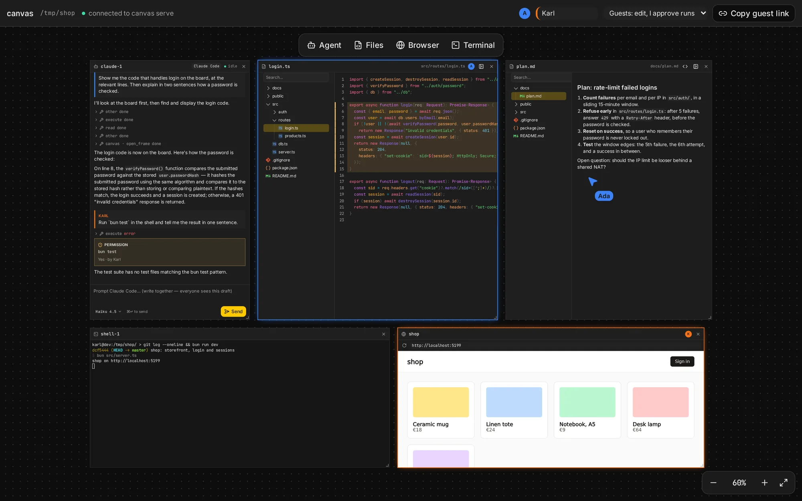

> **canvas is a prototype.** It exists to prove a concept, not to be relied on. It runs coding
> agents and shells on the host's machine and lets other people reach them through a browser. Do
> not use it for critical work, on machines or repositories that hold anything you cannot afford
> to leak, or anywhere security is an absolute requirement. Read [Security](/docs/security) and
> [Limits](/docs/limits) first.

canvas is a multiplayer board, like Miro, whose frames are coding-agent sessions, files of your
project, terminals and browser previews. The agents run on one person's machine. Everyone else
joins from their browser, peer to peer, and works on the same board: writing prompts together,
reading the same thread, looking at the same files.

## Who does what

- **The host** runs `canvas serve` in a project directory and opens the host link it prints.
  Agents, terminals and files live on the host's machine. The host's browser is the only thing
  that talks to `canvas serve`.
- **Guests** open the guest link the host shares and knock; the host lets each one in, with a
  [role](/docs/guests#members-and-roles): view, or edit (the host approves every run).
- **Agents** are frames on the board. Anyone with the edit role writes their prompts; agents can
  open and arrange frames themselves with the [board tools](/docs/board-tools).

## The layout

The board is not a free canvas: frames **snap into place**. A frame goes beside another in a row,
into a new row above or below, or into a cluster of its own, and the rest make room. Nothing
overlaps, nothing gets lost off to the side, and agents arrange their frames by the same rules. The
idea comes from tiling window managers like [niri](https://github.com/YaLTeR/niri), and like them the
board is best moved through with the keyboard: frame to frame, cluster to cluster, a row in full
screen. See [Layout](/docs/board#layout).

## Frames

| Frame                        | Shows                                                         |
| ---------------------------- | ------------------------------------------------------------- |
| [Agent](/docs/agent)         | A Claude Code or opencode session: its thread and a shared prompt draft |
| [Files](/docs/files)         | A project file, read-only and live, with a file tree          |
| [Terminal](/docs/terminal)   | A shell on the host's machine, mirrored to everyone           |
| [Browser](/docs/browser)     | A URL, loaded by each viewer's own browser                    |

## Next

- [Quick start](/docs/quick-start): run `canvas serve` and invite someone.
- [Architecture](/docs/architecture): how the pieces connect.
