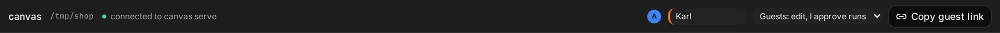

## Requirements

- [Bun](https://bun.sh). canvas is TypeScript and runs on Bun.
- At least one agent, installed and logged in on the host's machine:
  - [Claude Code](https://docs.claude.com/en/docs/claude-code): the `claude` CLI.
  - [opencode](https://opencode.ai): the `opencode` CLI.
- A current browser. canvas is developed and tested in Chromium.

canvas offers the agents it finds on the `PATH`. Guests need nothing but a browser.

## 1. Serve a project

In the project you want to work on:

```bash
bunx @frebreco/canvas serve
```

```
canvas serving /home/you/src/shop

  pair this browser as host, and open the board:
  https://ui.canvas.frebreco.de/?room=LEXuANjizGUi#k=…&pk=…&server=ws%3A%2F%2F127.0.0.1%3A4418&pair=…

  the link pairs one browser, within 10 minutes; keep it to yourself.
  share the guest link from the board instead.
```

`canvas serve` listens on `127.0.0.1:4418`. It writes its state to `.canvas/` in the project;
add that to your `.gitignore`.

## 2. Open the host link

Open the printed link in a browser on the same machine, within 10 minutes. The top bar says
**connected to canvas serve**. You are the host.

The first time, the link carries a **pairing code**: the first browser to open it is paired with
`canvas serve` as the host, and the code is used up. From then on `canvas serve` knows that browser
by its key: reloading, or opening the host link again later, needs no code. The same link in
another browser is refused. To be the host from another browser or device too, run `canvas pair`
in the project and open the link it prints there.

One tab is the host at a time. Open the link in another tab and the board moves there; the first
tab says so and offers **Use here** to take it back.

## 3. Add frames

The toolbar adds frames: **Agent**, **Files**, **Browser**, **Terminal**. Add an agent frame, pick
an agent, write a prompt and press **Send** (⌘/Ctrl-Enter).

## 4. Invite a guest

1. Press **Copy guest link** and send it.
2. When they open it, a card says they **want to join**, with their name and their browser's
   fingerprint. Press **Admit to edit** (or **Admit to view**, or **Deny**). See
   [Guests](/docs/guests#the-lobby).

The guest's browser finds the host's peer to peer and waits in the lobby until you let it in; next
time, the same browser comes straight in. Anything a guest wants to run on your machine appears as
an approval card for you.



## Restarting

Stop `canvas serve` with Ctrl-C. Started again in the same directory, it keeps the room, so the
links people have keep working, and it restores the board and the agent threads. Terminals start
a new shell.
