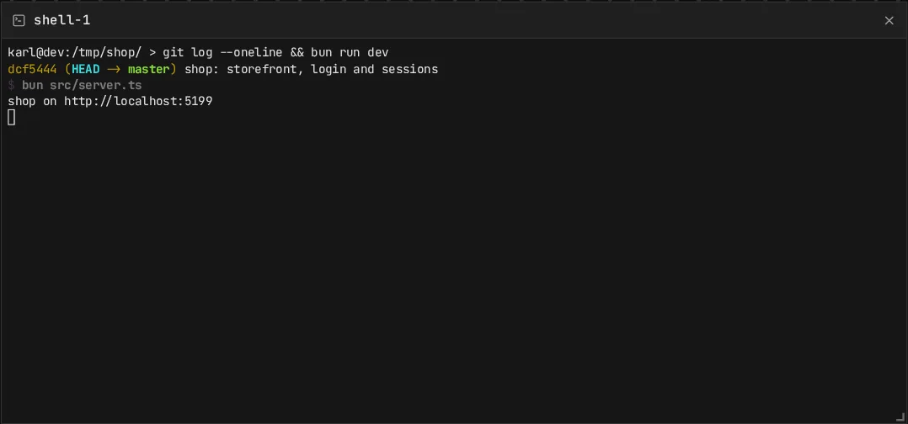

A terminal frame is a shell on the host's machine, started in the project directory. Everyone sees
its output live.

- **Who types**: the host, and guests with trusted access. Everyone else reads.
- **Size**: the shell follows the size of the host's frame.
- **Scroll**: whoever occupies the frame drives its scrollback for everyone following
  ([Focus](/docs/focus)).

## Lifetime

- The shell starts when the frame is added, by anyone who can edit the board.
- It keeps running until `canvas serve` stops, even if the frame is removed.
- After a restart of `canvas serve`, the frame starts a new shell. The old output is gone.

A trusted guest with a terminal can do anything the host's user can. See
[Security](/docs/security).
